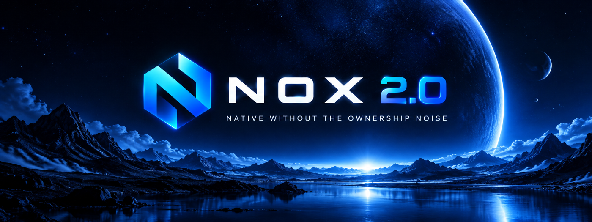

<p align="center">
  
</p>

# Nox

**Native without the ownership noise.** Nox is a statically typed language with Python's syntax, compiled ahead of time to native code, with automatic memory management and no ownership annotations — fast and deterministic, without borrowing rules to learn.

```nox
class Counter:
    n: int

    def __init__(self, start: int) -> None:
        self.n = start

    def bump(self) -> int:
        self.n += 1
        return self.n

async def square(x: int) -> int:
    return x * x

c: Counter = Counter(40)
c.bump()
a: Task[int] = spawn square(6)
print(c.bump(), await a)
```

```text
$ noxc run hello.nox
42 36
```

## Install

```sh
curl -fsSL https://noxlang.com/install.sh | sh
```

Windows (PowerShell): `irm https://noxlang.com/install.ps1 | iex`

## Documentation

Everything is at **<https://noxlang.com>** (the sources live in [`docs/`](docs/index.md)):

- [Tutorial](docs/tutorial/index.md) — from "hello" to a web service
- [Language reference](docs/language/index.md) and [standard library](docs/stdlib/index.md)
- [The three APIs](docs/apis/index.md): NAPI (the Nox source contract), NNI (the native C ABI) and the Plugin API
- [Tools](docs/tools/noxc.md): `noxc`, packages, the [noxpkg registry](https://noxpkg.noxlang.com), testing, the LSP
- [What's new in 2.0](docs/whatsnew/2.0.md) and [migrating from 1.x](docs/whatsnew/migrating.md)

## Contributing

See [Contributing](docs/internals/contributing.md) and, for the design rules every change must respect, [AGENTS.md](AGENTS.md). The release history is in [CHANGELOG.md](CHANGELOG.md) and the compatibility policy in [VERSIONING.md](VERSIONING.md).

## License

MIT — see [LICENSE](LICENSE).
